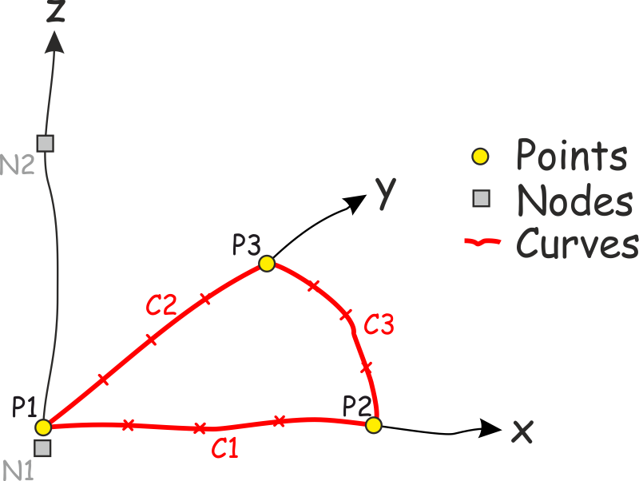
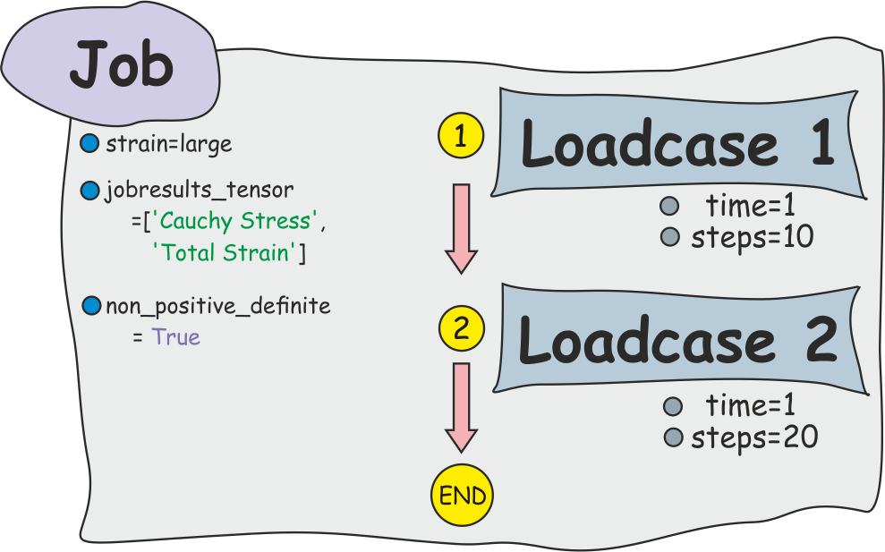
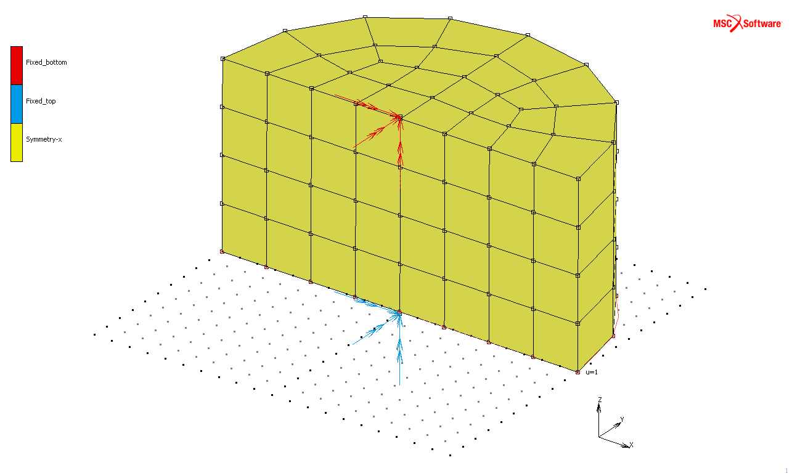
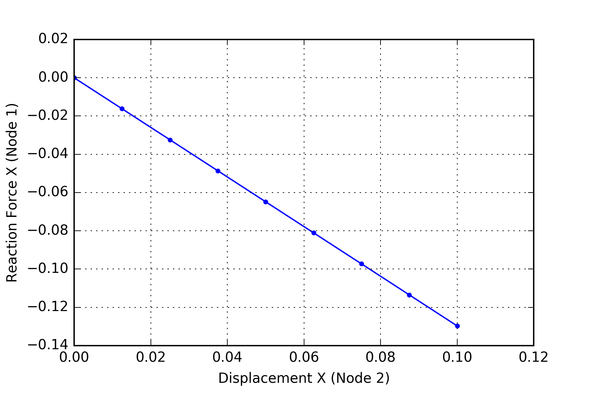

Getting Started
===============

The following example demonstrates the basic features of PrePostPy. The workflow is as follows:
 * Initiate an instance of a file object
 * add (offline-) objects e.g. Points, Curves, Nodes, Elements, Boundaries, Loadcases, Jobs
 * within an active connection to Mentat send all these objects to Mentat and
  + send (online-) commands to Mentat e.g. Automesh, Sweep, Select
 * submit a specified Job either through Mentat or directly to Marc
 * postprocess the postfile with HistoryPlots of nodal and elemental quantities at Nodes

Import PrePostPy
----------------

First we import prepostpy with it's own namespace and create an instance of the prepostpy-file class ``F``.

.. code:: python

    import prepostpy as pp

    # init file
    filename = r'C:\temp\model_101.mud'
    F = pp.File(filename)

Points, Curves and Nodes
------------------------
Now we add Nodes and Points with their respective coordinate triples and Curves with the appropriate point connectivity. These Points, Curves and Nodes may optionally be stored in a *Mentat-Set* of the corresponding type. Because the (lowercase) word *set* is reserved for built-in functions in Python we use the keyword `membership` instead. PrePostPy's file class supports dot-convention: All the items are stored in a SimpleNamespace_ `F.items`, followed by the user-defined name of the object. In this example e.q. the first Node is named `N1`. Curves Divisions are defined inside the Curve definitions in order to enable planar Automeshing. These Points, Curves and Nodes are also called `offline`-items, as they are created without a connection to Mentat. Instead these items are stored inside the PrePostPy's File instance and are sent to mentat in a rush. On the other hand, `online`-items need an active connection to Mentat, which will be discussed later.

.. code:: python

    # create Nodes
    F.item.N1 = pp.Node([0,0,-0.01], membership='n_bottom' )
    F.item.N2 = pp.Node([0,0, 1.01], membership='n_top')
    
    # create Points
    F.item.P1 = pp.Point([ 0, 0, 0])
    F.item.P2 = pp.Point([ 1, 0, 0])
    F.item.P3 = pp.Point([ 0, 1, 0])
    
    # create Curves
    F.item.C1 = pp.Curve('Line', [F.item.P1,F.item.P2], Divisions=4, Ratio=1)
    F.item.C2 = pp.Curve('Line', [F.item.P1,F.item.P3], Divisions=4, Ratio=1)
    F.item.C3 = pp.Curve('Arc Cen/Pnt/Pnt', [F.item.P1, 
                                             F.item.P2, 
                                             F.item.P3], Divisions=4)

   
   Sketch of Points, Curves (with Divisions) and Nodes

   
Tables
------
One-dimensional tables are needed to control the time-dependence of user-defined boundary conditions. Two different approaches are shown to add data points to a Table: either by the help of a 2D-array of points or by manually adding one point followed by another one.

.. code:: python

    # create Tables
    F.item.T1 = pp.Table(label='Table_1', category='time')
    F.item.T2 = pp.Table(label='Table_2', category='time')
    
    # add single points to T1
    F.item.T1.add_point([0,0])
    F.item.T1.add_point([1,1])
    F.item.T1.add_point([2,1])
    
    # create Points as 2D-Array for T2
    import numpy as np
    pts = np.array([[0,0],
                    [1,0],
                    [2,1]])
                    
    F.item.T2.add_points(pts)
    
.. figure:: images/tables.png
   :width: 75%
   :align: center
   :alt: Sketch of Timetables
   
   Sketch of Timetables
    
Boundaries
----------
PrePostPy supports two types of Boundary conditions: 

* *Fixed Displacement* and 
* *Point Load* (other types may be added in future versions). 

All Boundary conditions must contain Nodes to apply. These are submitted by the keyword `nodes`. The keyword `dof` (=Degree of Freedom) controls whether a dof is prescribed (`1` or `True`) or free (0` or `False`). Values for a prescribed dof are passed with the keyword `dof_values` as a list of values, on for each dof. With the help of the keyword `ramp` an automatic incrementation during the loadcase of the dof value is activated. Tables may be passed as a dictionary with keywords `x`, `y`, `z`, `rx`, `ry`, `rz`, `mx`, `my` or `mz`. All the mentioned functionality is demonstrated in this example. A special high-level category of Boundary condition which is not available in Mentat is `Symmetry-[axis]`. The axis is automatically set with `x|y|z` as the last character of the label.

.. code:: python

    # add Boundaries (Fixed Displacement)
    F.item.B1 = pp.Boundary(label='Fixed_bottom',
                            category='Fixed Displacement',
                            dof=[1,1,1,1,1,1],
                            dof_values=[0,0,0,0,0,0],
                            nodes='n_bottom')
                            
    F.item.B2 = pp.Boundary(label='Fixed_top',
                            category='Fixed Displacement',
                            dof=[1,1,1,1,1,1],
                            dof_values=[0.1,0,-0.1,0,0,0],
                            nodes='n_top', 
                            ramp='off',
                            tables={'z': F.item.T1,
                                    'x': F.item.T2})
    
    F.item.B3 = pp.Boundary('Symmetry-y')

Material Properties
-------------------
Material definition in PrePostPy is available for the following category of materials:
 * Elastic-Plastic Isotropic
 * Mooney

The elements to be applied are left empty in this example, as they do not exist before the elements are generated by automeshing. Instead this assignment will be performed during the active Mentat-Connection. For demonstration purpose a second material definition is shown but not used in this example.

.. code:: python

    # add Material definition for Rubber
    F.item.M1 = pp.Material(label='rubber',
                            category='Mooney',
                            #elements=[], 
                            C10=0.5,
                            #alpha=1.5e-4
                            )

    # add second Material definition for Steel
    # F.item.M2 = pp.Material(label='steel',
    #                         category='Elastic-Plastic Isotropic',
    #                         E=210000,
    #                         nu = 0.3
    #                         )

Loadcase and Job
----------------

Finally the boundary conditions are added to Loadcases. Only a limited number of Loadcase and Job properties are available through PrePostPy. Regarding the Loadcase these include the selection of active Boundary conditions, the number of steps, the loadcase time, the activation of Multi Criteria time stepping and the definition of relative convergence criteria. For the Job this even more basic: Loadcases are passed as a list - other options include the selection of the *strain-mode* (*small* or *large*).

.. code:: python

    # add loadcases
    lc_properties = {'convergence_force': 0.1,
                     'convergence_displacement': False,
                     'multi_criteria': False}
                     
    F.item.LC1 = pp.Loadcase(label='lc1',steps=10,time=1,
                             boundaries=[F.item.B1,F.item.B2,F.item.B3],
                             **lc_properties)
    F.item.LC2 = pp.Loadcase(label='lc2',steps=10,time=1,
                             boundaries=[F.item.B1,F.item.B2,F.item.B3],
                             **lc_properties)

    # create job and add loadcases
    F.item.J1 = pp.Job(label='job_sz_sx',
                       loadcases=[F.item.LC1, F.item.LC2],
                       strain='large')

   
   Sketch of Job structure and options

Mentat-Connection
-----------------
A connection to Mentat is established either by automatically starting a new Mentat window along with a procedure to initiate the Python socket connection (default) or by a connection to an already open Socket connection of Mentat. This is controlled with the boolean flag `startmentat`. Unfortunately it is not possible to open Mentat in the background through PrePostPy. There are several other options which could be helpful: It is possible to kill *all* instances of Mentat (Caution!) before calling Mentat from PrePostPy with `killmentat=True` or to quit Mentat after the connection to it is closed by setting `quitmentat=True`. Optionally the socket connection may be left open for further operations in the same Mentat window with `disconnect=False`. If several versions of Mentat are installed, PrePostPy selects the latest version by default - a custom version can be specified with the keyword `version`. **With** this instance of a Mentat-Connection (look for the *with* statement in the code) all previous items are rearranged and sent to Mentat. As the following code-blocks are splitted we choose Mentat not to quit after the `with` block and leave the socket connection enabled (`disconnect=False`). Normally all the following commands would be written inside one big `with`-statement (see full code listing at the end of this site).

.. code:: python

    MConn = pp.MentatConnection(version='latest', 
                                quitmentat=False, 
                                disconnect=False)

    with MConn:
        F.tomentat()

.. figure:: images/fig_tomentat.png
   :width: 75%
   :align: center
   :alt: The model with all items sent to Mentat
   
   The model with all items sent to Mentat

Automesh Geometry
~~~~~~~~~~~~~~~~~
Advanced-Front-Automeshers for Quadrilaterals, Tetraeders or both of them are available in PrePostPy. Before the Connection is re-enabled in PrePostPy, we choose not to open Mentat again - instead the current instance of Mentat with the open Socket connection is used.

**Hint:** Never open more than one socket connection simultaneously!

.. code:: python

    MConn.startmentat = False

    with MConn:
        F.Automesh.Planar.AdvancedFront.quad_mesh([F.item.C1,
                                                   F.item.C2,
                                                   F.item.C3], membership='elements_1')

.. figure:: images/fig_automesh_3dview.png
   :width: 75%
   :align: center
   :alt: Model with Automeshed area between Curves `[F.items.C1,F.items.C2,F.items.C3]`
   
   Model with Automeshed area between Curves `[F.items.C1,F.items.C2,F.items.C3]`

Operations on Geometry and Mesh
~~~~~~~~~~~~~~~~~~~~~~~~~~~~~~~
In this section the existing model objects are expanded in z-direction, mirrored normal to the x-axis. Finally a Sweep is performed.

.. code:: python

    with MConn:
        F.Operations.Expand.expand('elements_1',
                                   translations=[0,0,1/4],
                                   repetitions=4)
        
        F.Operations.Symmetry.symmetry(point=[0,0,0],normal=[1,0,0])
        F.Operations.Sweep.sweep('all')

   
   Model with mirrored elements alog the x-axis and expanded elements along the z-axis

Select Nodes and add them to an existing Boundary Condition (Symmetry y)
~~~~~~~~~~~~~~~~~~~~~~~~~~~~~~~~~~~~~~~~~~~~~~~~~~~~~~~~~~~~~~~~~~~~~~~~
All nodes at `y=0` are selected and added to the y-symmetry Boundary condition.

.. code:: python

    with MConn:
        F.Select.Box.select_zx('Nodes',y=0,clear=True,reset=True)
        F.item.B3.add_nodes('all_selected')
        
.. figure:: images/fig_sym-y.png
   :width: 75%
   :align: center
   :alt: Boundary condition `Symmetry-y` with nodes at y=0
   
   Boundary condition `Symmetry-y` with nodes at y=0

Rigid-Body-Elements (RBE2)
~~~~~~~~~~~~~~~~~~~~~~~~~~
In this section Rigid-Body-Elements (RBE2) are added to the model. This is done by a selection of all nodes on the top and bottom surface of the model. The RBE2 control node is identified by the item in the PrePostPy's File instance.

.. code:: python

    with MConn:
        F.Select.Box.select_xy('Nodes',z=0,clear=True,reset=True)
        F.Links.RBE2.new(label='RBE2_bottom',
                         dof=[1,1,1,1,1,1],
                         node=F.item.N1,
                         tied_nodes=['all_selected'])
        
        F.Select.Box.select_xy('Nodes',z=1,clear=True,reset=True)
        F.Links.RBE2.new(label='RBE2_top',
                         dof=[1,1,1,1,1,1],
                         node=F.item.N2,
                         tied_nodes=['all_selected'])
        
.. figure:: images/fig_rbe2.png
   :width: 75%
   :align: center
   :alt: RBE2-Spiders on top and bottom surfaces of the model
   
   RBE2-Spiders on top and bottom surfaces of the model

Add Elements to an existing Material definition
~~~~~~~~~~~~~~~~~~~~~~~~~~~~~~~~~~~~~~~~~~~~~~~
All elements are now added to the Rubber material.

.. code:: python

    with MConn:
        F.item.M1.add_elements('all_existing')

Definition of Element Types
~~~~~~~~~~~~~~~~~~~~~~~~~~~
Assigments of Element Types is done through an existing instance of a Job. This is somewhat confusing but was taken from the original menu structure of Mentat. Although this step is highly recommended, it is not strictly necessary as Mentat automatically chooses a default Element Type.

.. code:: python

    with MConn:
        F.item.J1.set_element_type(7, 'all_existing')

Check the Job and Save the File
~~~~~~~~~~~~~~~~~~~~~~~~~~~~~~~
Finally a check of the Job is performed and the file is saved with name specified at the beginning of this example. Before activating the Mentat-Connection again we choose to quit Mentat after this last step.

.. code:: python

    MConn.quitmentat = True
    
    with MConn:
        F.item.J1.check()
        F.savefile()

Job Submission
--------------
PrePostPy supports two kinds of how Job submissions are handled:
 * Submission through Mentat
 * *direct* submission to the Marc solver

The latter one is the default and recommended way to handle Job submissions. The user-defined number of threads are passed for the Job submission (no DDM!) if more than one thread is required.

.. code:: python

    F.submit(F.item.J1, threads=2)

.. figure:: images/fig_result_t2.png
   :width: 75%
   :align: center
   :alt: Contour Plot `Maximum Principal Value of Cauchy Stress` at Time `t=2`
   
   Contour Plot `Maximum Principal Value of Cauchy Stress` at Time `t=2`

Postprocess Results with History Plots
--------------------------------------
When the job has finished the force-displacement curves in x- and z-direction are shown as History Plots. In a first step, an instance of a PostFile class is generated. **With** this instance of a postfile, History Plots are added for the x- and z-directions. Optionally, these figures can be saved as PNG or PDF files. The data can be exported as a CSV table.

.. code:: python

    PF1 = pp.PostFile(filename,job=F.item.J1)

    with PF1 as PFile:
        
        data,fig,ax = PFile.HistoryPlot.add(x='Displacement Z',
                                            y='Reaction Force Z',
                                            increments=None,
                                            nodes=[2,1],
                                            show=True,reset=True)
        PFile.HistoryPlot.savefig('.pdf')
        PFile.HistoryPlot.savefig('.png')
        PFile.HistoryPlot.savedata('.csv')

    with PF1 as PFile:
        data,fig,ax = PFile.HistoryPlot.add(x='Displacement X',
                                            y='Reaction Force X',
                                            increments=None,
                                            nodes=[2,1],
                                            show=True,reset=True)
        PFile.HistoryPlot.savefig('.pdf')
        PFile.HistoryPlot.savefig('.png')
        PFile.HistoryPlot.savedata('.csv')
        
.. figure:: images/DisplacementZ-N2_ReactionForceZ-N1.png
   :width: 50%
   :align: center
   :alt: Force-Displacement Curve in z-Direction
   
   Force-Displacement Curve in z-Direction
    

   
   Force-Displacement Curve in x-Direction

.. _SimpleNamespace: https://docs.python.org/3/library/types.html